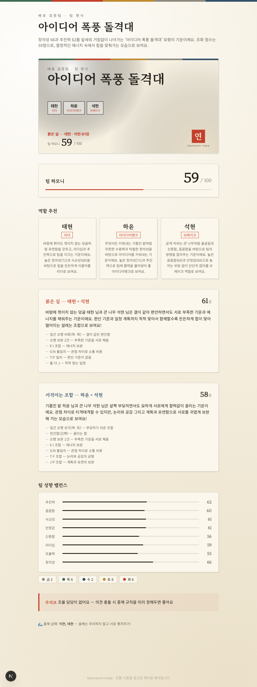
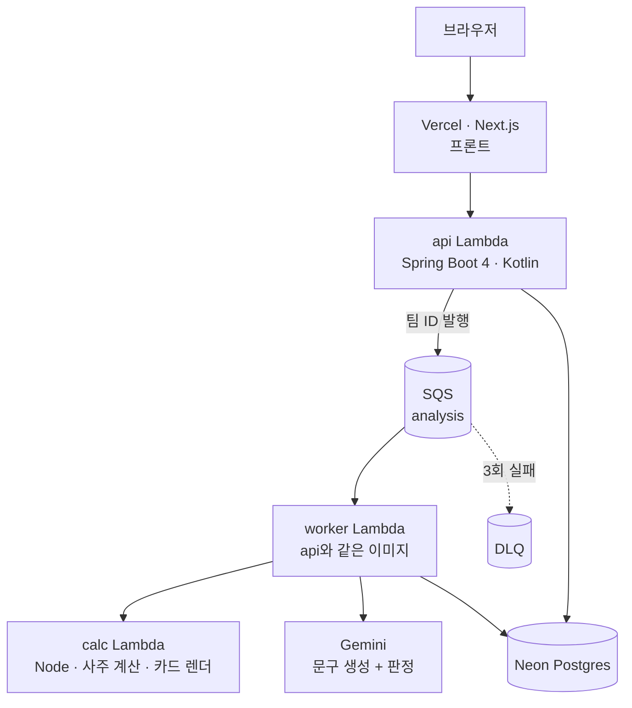

# TeamworkMate

**팀원들의 사주와 MBTI를 조합해 역할·궁합·팀 밸런스를 뽑아주는 재미용 리포트 서비스**

계정 없이 링크만 공유하면 되고, 팀원이 생일과 MBTI를 넣으면 리더·총무·브레이크 같은 역할을 배정하고 누구와 누가 잘 맞는지 점수로 보여줍니다.

🔗 **API**: `https://uzppcukwhqctn6udpf7xavdzli0tvuva.lambda-url.ap-southeast-1.on.aws/`
*(비용 관리를 위해 내려둘 수 있습니다. `cdk deploy` 한 번이면 5분 안에 복구됩니다.)*



---

## 이 프로젝트의 목적

재미용 서비스지만, 만든 이유는 **백엔드 엔지니어링을 제대로 해보기 위해서**입니다. 그래서 다음을 의도적으로 끌어안았습니다.

- **점수와 문장의 책임 분리** — 왜 이 점수가 나왔는지 전부 설명 가능한 구조
- **LLM을 신뢰하지 않는 LLM 파이프라인** — 생성한 문장을 별도 모델이 검증하고, 통과한 것만 서빙
- **동기 요청에서 무거운 작업 분리** — 큐, 재시도, 실패 격리
- **외부 의존성 격리** — 사주 계산·LLM·큐를 전부 포트 뒤에 둠

---

## 아키텍처



| 레포 | 역할 | 스택 |
|---|---|---|
| **api** (이 저장소) | 도메인 로직, 점수 엔진, LLM 파이프라인, 상태 머신 | Spring Boot 4 · Kotlin 2.3 · JPA · Flyway |
| [calc](https://github.com/noyhkos/teamwork-mate-calc) | 사주 계산, 공유 카드 이미지 렌더 | Node · Fastify · ssaju · satori |
| [front](https://github.com/noyhkos/teamwork-mate-front) | 입력 폼, 리포트 화면 | Next.js 16 · Tailwind v4 |
| [infra](https://github.com/noyhkos/teamwork-mate-infra) | 배포 정의 | AWS CDK · TypeScript |

**계산만 Node로 뺀 이유**는 아키텍처 취향이 아니라 제약입니다. 검증을 마친 한국식 사주 라이브러리(`ssaju`)가 TypeScript 전용이라, 포팅 리스크를 감수하는 대신 언어 경계에서 서비스로 격리했습니다. 그 외 도메인 로직은 전부 Spring 안에 있습니다.

---

## 설계 결정

### ① 점수는 코드가, 문장은 LLM이

역할 점수와 궁합 점수는 **전부 결정론적 공식**입니다. 같은 입력이면 언제 돌려도 같은 결과가 나옵니다. LLM은 그 결과를 사람 말로 옮기는 역할만 합니다.

그리고 모든 가감점은 근거를 함께 기록합니다.

```kotlin
data class PairFactor(val code: String, val label: String, val delta: Double)
```

리포트에 "일간 오행 상극(목·금) — 부딪히기 쉬운 조합"처럼 그대로 노출되므로, **점수가 왜 그렇게 나왔는지 설명하지 못하는 구간이 없습니다.**

### ② grounding은 "점수에 기여한 사실"만

LLM에 넘기는 근거를 **점수 계산에 실제로 쓰인 사실로 제한**했습니다. 사주 명식 전체를 넘기지 않습니다.

전체를 주면 *"월지에 인성이 있어 총무에 어울립니다"* 같은 문장이 나올 수 있습니다. 사주적으로 그럴듯하고 근거 안에 있으니 검증도 통과하지만, **정작 우리 점수는 그렇게 계산되지 않았습니다.** 설명과 계산이 어긋나는 이 문제를 grounding 범위로 차단했습니다.

대신 문장이 밋밋해지지 않도록, 일간 10개의 상징 사전을 결정론적으로 만들어 함께 넘깁니다. 은유는 이 범위 안에서만 나옵니다.

```
庚 → 경금 · 단단한 무쇠와 바위 · [결단, 추진, 의리]
乙 → 을목 · 바람에 휘어도 꺾이지 않는 덩굴 · [유연함, 생존력, 섬세함]
```

### ③ 판정을 통과한 문장만 서빙

생성 모델과 **다른** 모델이 문장마다 주장을 추출해 근거와 대조합니다. `unsupported` 판정이 하나라도 있으면 서빙하지 않습니다.

```
grounding → 생성 → judge 판정 → (통과) 저장·서빙
                              → (탈락) 피드백 붙여 1회 재시도
                              → (재탈락) 결정론 템플릿으로 폴백
```

- 판정 호출 자체가 실패해도 **검증되지 않은 문장은 절대 나가지 않습니다**
- LLM이 전부 죽어도 리포트는 템플릿으로 정상 출력됩니다
- 모든 생성과 판정은 `llm_generations` / `eval_results`에 남아 통과율을 숫자로 볼 수 있습니다

생성과 판정에 다른 모델을 쓰는 이유는 self-preference bias 때문입니다.

### ④ 분석을 요청 스레드에서 들어냈다

분석 한 건은 사주 계산 + 점수 + LLM 생성·판정까지 **약 1분**이 걸립니다. 처음에는 이걸 HTTP 요청 안에서 처리했고, 응답이 47초 걸렸습니다.

지금은 요청이 큐에 넣고 즉시 반환합니다.

| | 이전 | 현재 |
|---|---|---|
| `POST /analyze` 응답 | 40~48초 | **0.06초** (로컬) / 1.2초 (Lambda) |
| 처리 | 요청 스레드 | SQS → 워커 |
| 서버 재시작 시 | 작업 소실 | 큐에 남아 재처리 |

메시지는 **작업이 끝난 뒤에만 삭제**합니다. 워커가 중간에 죽으면 메시지가 다시 보이면서 재처리되고, 3회 실패하면 DLQ로 격리되어 나머지 처리를 막지 않습니다. 배치 안에 처리 불가능한 메시지가 섞여 있으면 그것만 실패로 보고해 정상 메시지의 재처리를 피합니다.

`done` 상태는 LLM 문구까지 끝난 뒤에 찍습니다. 결정론 파이프라인 직후에 찍었더니 리포트 첫 화면이 절반은 템플릿, 절반은 LLM인 상태로 보이는 문제가 있었습니다.

### ⑤ 외부 의존성은 포트 뒤로

```kotlin
interface CalcPort   { fun fetchFacts(member: Member, now: Instant): JsonNode }
interface LlmPort    { fun complete(model: String, prompt: String, schemaJson: String): String }
interface QueuePort  { fun submit(teamId: UUID) }
```

덕분에 테스트는 외부 호출 없이 전 구간을 돌리고, 큐는 로컬(인메모리)과 배포(SQS)가 호출부 수정 없이 교체됩니다. 판정 거부·LLM 장애·poison message 같은 실패 경로도 테스트로 고정돼 있습니다.

### ⑥ 계정 없는 권한 모델

가입 없이 쓰는 서비스라 **URL 토큰 2종**으로 권한을 나눴습니다.

- `admin` 토큰 — 팀 관리, 대리 입력, 분석 실행
- `invite` 토큰 — 본인 정보 입력, 리포트 열람

초대 링크 응답에 관리자 토큰이 새지 않는다는 것과, 초대 뷰가 다른 사람의 생년월일을 노출하지 않는다는 것을 **테스트로 고정**했습니다.

---

## 사주 계산에서 만난 함정

`ssaju`는 출생 시간을 넘기지 않으면 **조용히 정오로 가정**합니다. 그대로 두면 "시간 모름"인 사람에게 실제로는 없는 시주(時柱)가 생기고, 그게 오행 집계와 강약 판정까지 오염시킵니다.

그래서 래퍼에서 차단했습니다.

- 시간 미상이면 시주를 **제거**하고 오행을 3주 기준으로 재집계
- 신강/신약 판정은 **보류**(null)
- 이 사실이 LLM grounding까지 전달되어, 시간 모름인 멤버에게는 시주 관련 언급이 나오지 않음

계산 결과는 `lunar-javascript`와 교차검증했습니다(일주 6/6, 입춘 경계 3/3).

---

## 로컬 실행

```bash
# 1. Postgres
docker compose up -d

# 2. 사주 계산 서비스
cd ../calc && npm install && npm run serve

# 3. API  (.env 에 GEMINI_API_KEY 를 넣으면 LLM 문구가 켜집니다)
./gradlew bootRun

# 4. 프론트
cd ../front && npm install && npm run dev
```

`GEMINI_API_KEY`가 없으면 LLM 레이어는 조용히 꺼지고 결정론 템플릿으로 동작합니다.

---

## 테스트

```bash
./gradlew test        # api  60개
cd ../calc && npx vitest run   # calc 28개
```

점수 엔진은 **골든 테스트**로 고정돼 있습니다. 검증용 사주 차트의 특성 벡터, 역할 점수, 페어 점수를 손으로 계산해 박아두어, 가중치를 건드리면 즉시 깨집니다.

---

## 배포

```bash
cd ../infra
npx cdk diff      # 무엇이 바뀔지 먼저 확인
npx cdk deploy
npx cdk destroy   # 전부 내림
```

Lambda 3개(api·worker·calc), SQS + DLQ, Function URL, 워머 규칙까지 CDK로 정의돼 있습니다. api와 worker는 **같은 컨테이너 이미지**를 쓰고 환경변수 하나로 역할이 갈립니다.

Spring Boot를 Lambda에서 돌리기 위해 **AWS Lambda Web Adapter**를 씁니다. HTTP만 아는 얇은 프록시라 프레임워크 호환성 문제가 없고, SQS 같은 비HTTP 트리거도 `/events`로 전달해주기 때문에 이미지를 하나로 유지할 수 있습니다.

**실측**: 콜드스타트 30.8초 / warm 0.24초 / 분석 완료까지 96초.
콜드스타트는 EventBridge가 5분마다 깨워 완화합니다.

---

## 알려진 한계

정직하게 적어둡니다.

- **콜드스타트 30초** — 워머가 멈춘 직후 첫 방문자는 그대로 겪습니다. 근본 해결은 ZIP 패키징 + SnapStart지만 아직 적용하지 않았습니다.
- **SSM 파라미터가 String 타입** — SecureString은 CloudFormation이 Lambda 환경변수로 주입하지 못해, 앱이 런타임에 직접 조회해야 합니다. 지금은 트레이드오프를 인지하고 String을 씁니다.
- **프롬프트 인젝션 방어가 프롬프트 수준** — 닉네임이 그대로 프롬프트에 들어갑니다. 규칙으로만 막고 있습니다.
- **테스트가 개발 DB를 공유** — Testcontainers 미도입이라 테스트 실행이 로컬 DB에 행을 남깁니다.
- **재미용 해석** — 전통 이론을 참고한 오락물이며, 어떤 판단의 근거로도 쓰일 수 없습니다.

---

## 다음

- GitHub Actions CI/CD
- 프론트 Vercel 배포
- 리포트 v2 (연애 모드, 전체 궁합 히트맵)
